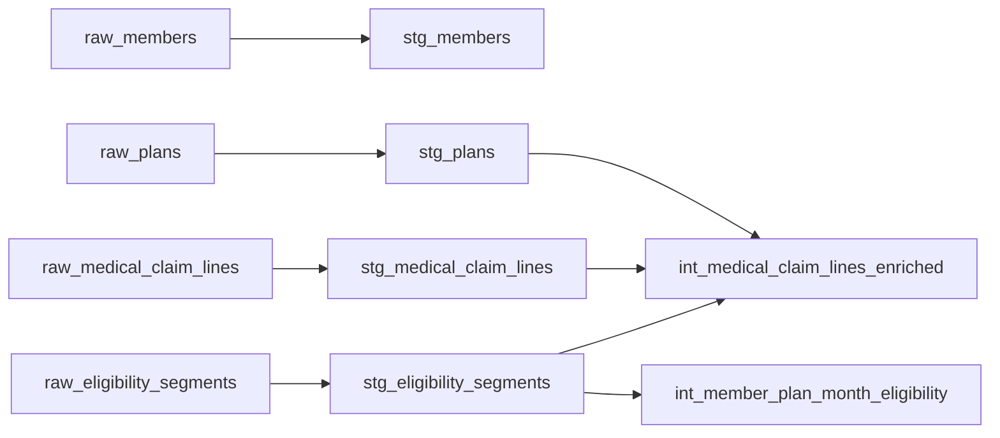

# Healthcare Claims Analytics (dbt)

A dbt project that models healthcare eligibility and medical claims the way a managed care
organization does: effective-dated enrollment, claim attribution by date of service, and
member-month denominators for PMPM and utilization metrics.

Built on dbt Core and DuckDB, so it runs locally with no cloud account. All data is synthetic.

## What this project demonstrates

- **Temporal eligibility modeling.** Members move between plans over time, with gaps and
  re-enrollments. Dual-eligible and LTSS status change with those moves, so they are treated
  as attributes *of a point in time*, not of the member.
- **Date-based claim attribution.** Each claim line is matched to the eligibility segment
  active on its `service_from_date`. Claim lines with no matching eligibility are kept and
  flagged rather than dropped.
- **Member-month construction.** Eligibility segments are converted into one row per member,
  plan, and month, the denominator for per-member-per-month (PMPM) metrics.
- **Testing as a design tool.** Generic and custom tests enforce the business rules the
  downstream models depend on, including no overlapping eligibility per member and no row
  duplication during claim enrichment.

## Data model



| Layer | Models | Purpose |
|---|---|---|
| Seeds | `raw_members`, `raw_plans`, `raw_eligibility_segments`, `raw_medical_claim_lines` | Synthetic source data |
| Staging | `stg_*` | Rename, type-cast, trim, standardize codes; no business logic |
| Intermediate | `int_member_plan_month_eligibility` | One row per member, plan, and month with at least one eligible day |
| | `int_medical_claim_lines_enriched` | One row per claim line, with eligibility and plan context as of the service date |

Planned next: analytics-ready dimensions and facts, and a utilization mart combining claims
(numerator) with member months (denominator) for PMPM and claims-per-1,000 metrics.

## Key design decisions

**A member belongs to one plan at a time.** When a member receives several benefits at once
(for example, Medicare and Medicaid), they are enrolled in a single plan that provides both,
such as a dual-eligible special needs plan (DSNP), rather than in two concurrent plans. This
mirrors how integrated plans work in practice, and it is enforced by a test: no two
eligibility segments for the same member may overlap, regardless of plan.

**Term dates are inclusive.** A member is covered *on* their `term_date`. A segment that starts
on the same day another ends is therefore an overlap; back-to-back segments start the day after.

**Unmatched claims are retained, not dropped.** Claim lines with no eligibility on their service
date are kept in the enriched model with `has_matching_eligibility = false`, so they can be
investigated rather than silently disappearing from totals.

**Eligibility flags are not on the member.** Dual and LTSS status depend on the plan a member is
in at a given time, so they belong on time-based facts, not on a member dimension.

## Testing

| Test type | Examples |
|---|---|
| Generic | `unique`, `not_null`, `accepted_values` on code columns, `relationships` between models |
| Singular | `stg_plans_date_range`: no plan ends before it starts |
| | `stg_eligibility_segments_no_overlaps`: no member has two segments covering the same day |
| | `int_medical_claim_lines_enriched` row count and grain checks: the eligibility join adds or removes no claim lines |

## Running the project

Requires Python 3.10+.

```bash
git clone https://github.com/jkimdatadev/healthcare-claims-dbt
cd healthcare-claims-dbt
python -m venv dbt-env
# Windows: .\dbt-env\Scripts\Activate    macOS/Linux: source dbt-env/bin/activate
pip install dbt-core==1.12.5 dbt-duckdb==1.11.0
```

Add this profile to `~/.dbt/profiles.yml`:

```yaml
healthcare_claims_dbt:
  target: dev
  outputs:
    dev:
      type: duckdb
      path: dev.duckdb
```

Then build everything (seeds, models, and tests) from the dbt project folder:

```bash
cd healthcare_claims_dbt
dbt build
```

## Repository layout

```
healthcare-claims-dbt/
├── docs/                         Design specs for models
└── healthcare_claims_dbt/        The dbt project
    ├── analyses/                 Exploration queries (not built)
    ├── models/
    │   ├── staging/
    │   └── intermediate/
    ├── scripts/                  Synthetic data generation
    ├── seeds/                    Synthetic source data
    └── tests/                    Singular tests
```

## Conventions

- **SQL:** lowercase keywords, four-space indentation, trailing commas, one space before `as`.
- **Blank lines** separate independent units (models in YAML, sections in config), not steps
  within one query.
- **Code columns** (`*_code`) are trimmed and uppercased in staging; name columns keep their case.
- **Singular tests** are named `<model>_<rule>`.

## About the data

All data is synthetic and generated for this project. No real member, provider, or claims
information is included.
